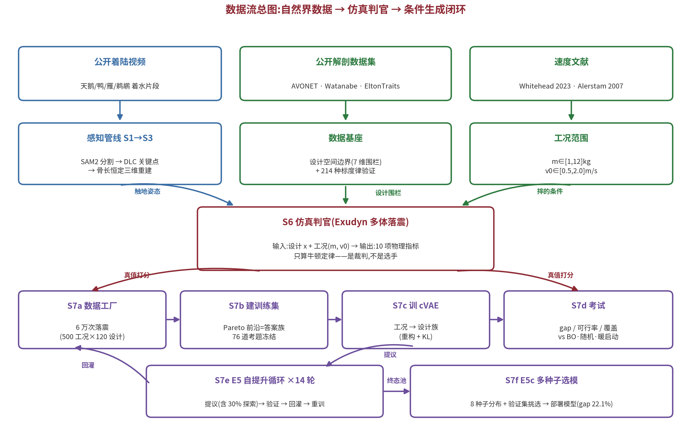

# 阶段输入输出手册——全链路每个环节:输入 · 输出 · 优化什么 · 目的 · 指标

> 配套《参数溯源表》(参数从哪来)与《多保真代理实验报告》《生成阶段实验报告》(结果)。
> 本手册回答:**数据在系统里怎么流**。白话优先。

## 0. 数据流总图

三条自然界数据线(视频→感知、数据集→基座、文献→工况)汇入仿真判官;
判官为生成线全程打真值分;E5 循环让"学生与教材互相抬高",E5c 无泄露选出部署模型。

## 一、感知线(视频 → 生物先验)

| 阶段 | 输入 | 输出 | 优化/筛选什么 | 目的 | 关键指标 |
|---|---|---|---|---|---|
| S1 分割(SAM2) | 着陆视频 + 首帧一个点提示 | 逐帧腿部掩码 masks/ + seg.json | 无(预训练大模型直接推理) | 把腿从水花/背景里稳定抠出来 | 人眼回放:自遮挡帧是否跟丢 |
| S2 关键点(DeepLabCut) | 视频帧 + 少量人工标注(SuperBird 迁移) | kp.json(逐帧 2D 关节坐标+置信度) | 网络微调:关键点回归损失 | 髋/膝/踝/跖/趾的像素坐标 | 测试 RMSE、mAP;低置信过滤 |
| S3 三维重建(骨长恒定) | kp.json | motionchain.json(连杆比+角度时序)、joints3d.json | **约束反解**:骨头不变长 → 反推深度(非学习) | 单目视频升成三维运动链 | 3D 骨长 CV 5–7%(越稳越可信) |
| S3b 深度验证(VGGT-Omega) | 视频帧 + 深度大模型 | depth.npz + 验证报告 | 无(独立推理当对照) | 检验"深度直算"路线可行性 | 骨长 CV 27–34% → **不合格,负结果定案** |
| S5 生物耦合 | kp.json | bio_landing_law.csv(尺度无关着陆律) | 无(统计提炼) | 发现"慢-快-慢"与预判式(65% 动作在触地前) | 时序签名 τ;跨物种一致性 |

**感知线的出口**(被后面引用的三样东西):触地姿态(50°/120°/90°)、天鹅几何参考、预判式叙事。

## 二、数据基座(公开数据集 → 边界与验证)

| 阶段 | 输入 | 输出 | 优化/筛选什么 | 目的 | 关键指标 |
|---|---|---|---|---|---|
| 标度律分析(allometry_data.py) | AVONET 跗跖长 + EltonTraits 体重(学名联接) | 214 种水鸟表 + 回归指数 b | log-log 最小二乘 | 验证"腿长随体重超比例"是否真实 | b=0.39±0.03,落入模型带 0.37–0.49 |
| 骨骼解析(parse_watanabe.py) | Watanabe 2017 论文 PDF 附录表 10 | watanabe2017_anatidae.csv(91 种三段骨长) | 无(表格解析) | 定 r2/r3 实测边界;核验天鹅参数 | r2∈1.49–2.09,r3∈0.84–1.28;核验偏差 2–7% |

**基座的出口**:设计空间边界(L1 33–121mm + 两比例区间)——生成线撒点的"围栏"。

## 三、仿真判官(设计 → 物理成绩)

| 阶段 | 输入 | 输出 | 优化/筛选什么 | 目的 | 关键指标 |
|---|---|---|---|---|---|
| Exudyn 落震(hf_exudyn.py) | 设计 x(3 或 7 维)+ 工况(m, v0)+ 配簧规则 | **10 项指标**:峰值过载、行程、η、CFE、jerk、吸收能量、峰值力、回弹、弹跳数、镇定时间 | **无——只算牛顿定律,是裁判不是选手** | 把"尺寸"翻译成"受力" | 能量守恒闭合 99.6%;单次 ~2s |
| 代理选型(mf_experiment.py) | LHS 采样的(设计,工况)+ 判官答案 | 四方法 NRMSE 对比表 | GPR:核超参最大化边际似然;残差法:先物理公式再学误差 | 回答"样本少时物理先验值不值钱" | n≤9 物理先验胜 2–3×;n≥12 黑盒反超 |

## 四、生成线(工况 → 设计族)

| 阶段 | 输入 | 输出 | 优化/筛选什么 | 目的 | 关键指标 |
|---|---|---|---|---|---|
| S7a 数据工厂(data_factory.py) | 工况范围(m 1–12kg, v0 0.5–2)× 设计边界(7 维) | factory.jsonl:500 工况 × 120 设计 × 10 指标 = 6 万条 | 无(做题攒答案) | 攒原始物料;g_cap/stroke_max 是事后筛选参数,不进仿真 | 零失效;铺满范围 |
| S7b 建训练集(build_dataset.py) | factory.jsonl | 训练对(工况+约束 → 前沿设计族)+ 76 道冻结考题 | Pareto 筛选:疼与蹲两目标,不被全面碾压者入选 | 整理"考题→标准答案族" | 训练对 ~10 万;考题冻结 |
| S7c 训 cVAE(train_cvae.py) | 训练对(归一化) | cvae.pt(工况 → 40 个设计) | ★真 loss:重构误差 + KL 正则(防死记硬背) | 把逐题优化压缩成看题秒答 | 训练看 mse/KL 健康度;真成绩看考试 |
| S7d 考试(eval_gen.py) | 模型 + 冻结考题 + 现场参考前沿(300 设计/题) | gap、可行率、覆盖率;四选手对比 | 无(纯打分) | 客观比较 生成/BO/随机/暖启动 | gap 中位数(0%=追平已知最优) |
| S7e E5 循环(e5_loop.py) | 当前模型 + 设计池 | 更大的池(19.2 万验证设计)+ 更强模型 + 轨迹 | **无显式目标函数**——机制是数据变好:提议(含 30% 随机探索)→ 判官实摔 → 好的进池 → 重训 | 学生和教材互相抬高(expert iteration) | 轨迹 90%→终态分布 27.8±5.3% |
| S7f E5c 选模(e5_seeds.py) | 终态池 × 8 种子 | 8 个模型 + 分布 + 部署模型 cvae_s2.pt | 挑选规则:24 道**全新验证题**上最优(冻结考题只报分) | 排除运气;无泄露的正式成绩 | 分布 27.8±5.3%;选中者 22.1%、零崩盘 |
| S7g 重测(e5_remeasure.py,在跑) | 各轮池子快照(由增量重建)× 3 种子 | 论文级轨迹带图 | 无(重读历史,不重跑进化) | 把单种子仪表换成分布带 | 每轮 3 种子极差带 |

## 五、三个全局要点(理解整条链的钥匙)

1. **整条链只有两处真正的"优化"**:S7c 的 cVAE loss(模仿好设计)和 Pareto 筛选规则
   (定义什么算好:两目标互不碾压)。判官(Exudyn)永远只算物理,不优化、不可被骗;
2. **训练比参数,考试比物理**:cVAE 学习时模仿设计参数;但一切评价都靠真摔出来的
   物理指标——新奇构型只要成绩好即被录用(创新入口在 E5 的探索+验证通道);
3. **考题与进化零接触**:76 道冻结考题只是挂在墙上的仪表盘,回灌方向由判官对候选的
   逐个验证决定——所以仪表噪声不污染进化,资产(设计池)始终干净。
